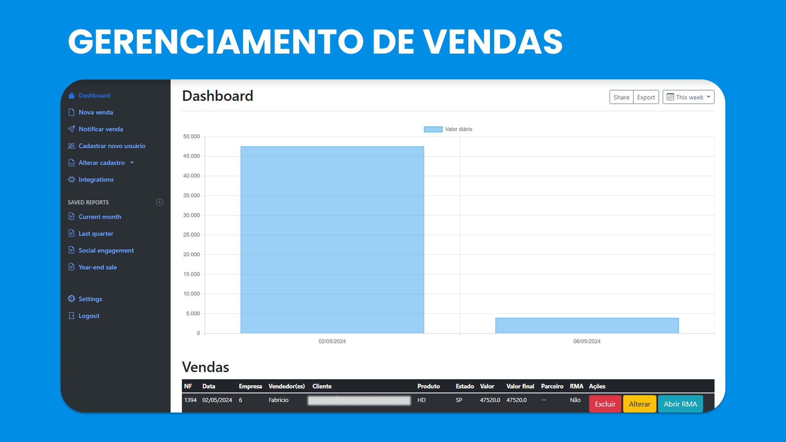

# 📊 Gerenciamento de Vendas
Sistema para gestão e acompanhamento de vendas comerciais entre supervisores e equipe de vendas, permitindo um controle eficiente do histórico, visibilidade da meta mensal, exportar planilha de comissionamento, script de status de pedido para consultar os supervisores.

### EM DESENVOVIMENTO

## 🛠️ Quais tecnologias foram utilizadas?
- [x] <strong>Frontend:</strong> HTML, CSS, Bootstrap
- [x] <strong>Backend:</strong> Python, Flask
- [x] <strong>Banco de Dados:</strong> MySQL, ORM
- [x] <strong>Scripts e Funcionalidades:</strong> JavaScript 


## 🛠 Instalação e configuração
Siga os passos abaixo para rodar o projeto localmente:
### 🔹 1. Clone o repositório
```
git clone https://github.com/LealDevhub/gerenciamento de vendas.git
```
### 🔹 2. Configure o ambiente
Certifique-se de que você possui o Python instalado e um ambiente de desenvolvimento com XAMPP (ou outro servidor que suporte Apache e MySQL).

### 🔹 3. Inicie os serviços
Ative o Apache e MySQL no XAMPP antes de continuar.

### 🔹 4. Configure o Banco de Dados
Execute o seguinte comando para configurar o banco de dados:
```
python config_db.py
```
### 🔹 5. Inicie a aplicação 
```
python app.py
```
O sistema estará acessível pelo navegador no endereço:
🔗 <a href="http://localhost:5000">http://localhost:5000</a>

---

## 💡 Contribuição
Fique à vontade para contribuir com melhorias! Basta abrir uma issue ou fazer um pull request.

## 📜 Licença
Este projeto foi desenvolvido pelo Lealdev ❤️ e está disponível para fins acadêmicos e educacionais.
